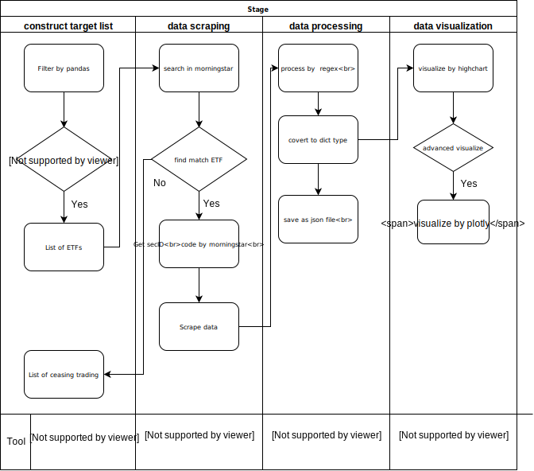
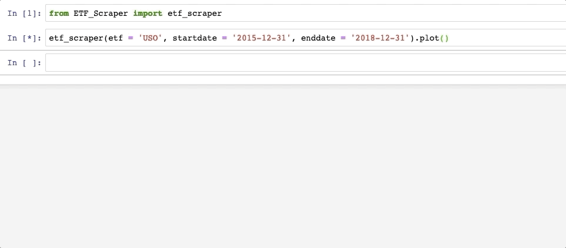
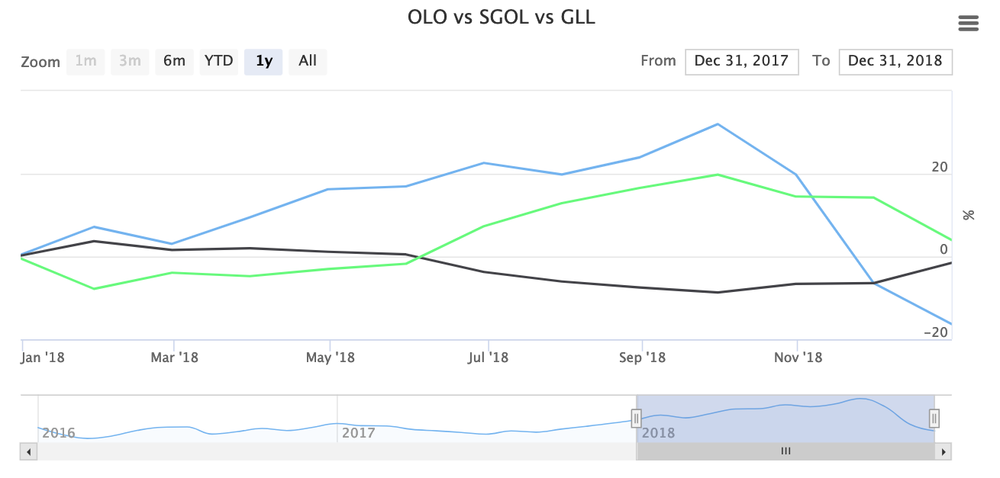
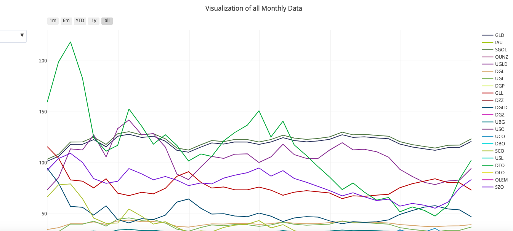

# HW1
## Web Scraping and Data Visualization
- Flowchart




--- 
## Part I - Web scraping
Below is introduction of my scraper
## ETF_Scraper
### A simple scraper for ETF, scrape data from [morningstar](https://www.morningstar.com/)



---
### Usage
Only work on jupyter notebook (sorry...)
1. Clone `ETF_Scraper.py` to your cwd
2. Before using it, please make sure you have installed following moudules :   
`time` `numpy` `pandas` `json` `requests` `BeautifulSoup4` `re` `datetime` `highcharts`
3. Play with it !
``` python
from ETF_Scraper import etf_scraper
etf_scraper(etf = 'USO', startdate = '2015-12-31', enddate = '2018-12-31').plot()
```
As above example code, you have to type three arguments, `etf`, `startdate` and `enddate`.  

The `plot()` function can plot volume, price and nav, you can also choose to plot only one information by entering different `plt_type`.  
For example, the below code will plot only nav.
``` python
etf_scraper(etf = 'USO', startdate = '2015-12-31', enddate = '2018-12-31').plot(plt_type = 'nav')
```
Hence, the `plot()` has three alternatives `'nav'` , `price` and `'all'`, default is `'all'`.

Moreover, you can get data by change `plot()` to `data()` :
``` python
etf_scraper(etf = 'USO', startdate = '2015-12-31', enddate = '2018-12-31').data(data_type = 'nav')
```
The `data()` function can scrape volume, price or nav, you can choose the data you want among these three different types.
There are three options `'nav'` , `price` and `'volume'`, default is `'nav'`.

## Part II - Data visualization
- visualization of single ETF


- visualization of random three ETFs (monthly data)



- visualization of all ETFs (monthly data)  
Can observe different types of ETF (Crude Oil, Gold) or range by `dropdown menu`



上圖可直接至[plotly 網站](https://plot.ly/~r05323045/6/visualization-of-all-monthly-data/)觀看


### Note:  
- 目前爬蟲速度很慢QQ 還請同組資工大神們幫忙除蟲或提供更好的寫法，THX !

